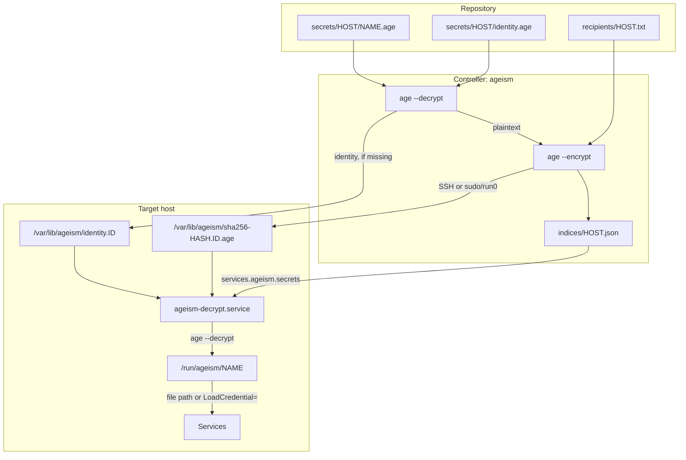

# How it works

The diagram shows how a secret moves from the repository to a running service when `ageism` is used with the [NixOS module](./nixos-module).

1. On the controller, `ageism` decrypts the source secrets and the host identity with your identity, then re-encrypts the secrets to the host's recipient.
2. The host identity and the re-encrypted secrets are written to `/var/lib/ageism` on the target. The index file records the deployed filename of each secret.
3. The NixOS configuration reads the index file to declare `services.ageism.secrets`. On the target, `ageism-decrypt.service` decrypts each secret with the matching `identity.ID` and installs the plaintext at its `path`.
4. Services read the plaintext directly or through [systemd credentials](./systemd-credentials).

The rest of this page describes each phase of a deployment.

## 1. Discovery and hashing

`ageism` scans `--secrets-root/<host>` for `*.age` files, following symlinks, and computes the SHA-256 hash of each dereferenced source file. `identity.age` is reserved for the host's encrypted identity and is never deployed as a secret.

## 2. Inspection

It lists the target's destination directory (`/var/lib/ageism` by default, or `--install-dir`) to find secrets that are already deployed (files with a `sha256-` prefix) and identities (`identity.<ID>`).

## 3. Decryption

The host identity (if missing on the target) and any missing secrets are decrypted locally with `age --decrypt`. Secrets shared between hosts are decrypted only once and kept in an in-memory cache for the rest of the run.

## 4. Encryption and transfer

For each target host, concurrently:

- The decrypted identity is written to `identity.<ID>` with `0600` permissions, unless a file with the same ID already exists. `ID` is the first 8 hex characters of the SHA-256 digest of the **encrypted** `identity.age`.
- Plaintexts are encrypted to the host's recipient with `age --encrypt`.
- The re-encrypted ciphertexts are transferred and written as `sha256-<sha256>.<ID>.age` with `0600` permissions.

Remote hosts are reached through a single multiplexed SSH connection to `root@<host>`, shared by the inspection and all transfers. Localhost is handled through a persistent elevated shell (`sudo` or `run0`).

A failure on one host is reported but does not stop deployment to the other hosts.

## 5. Index output

If `--index-out-dir` is given, `<index-out-dir>/<host>.json` is written, mapping each secret name to its deployed filename. See [Index file](../reference/index-file).

## Identity rotation

Because each identity is stored under an ID derived from its encrypted file, replacing `identity.age` installs a new `identity.<ID>` alongside the old one. Existing identities are never re-transferred or removed, so secrets encrypted to an older identity remain decryptable.

## At boot

On the target, each `*.<ID>.age` secret is decrypted with the matching `identity.<ID>`. The [NixOS module](./nixos-module) provides a systemd service that does this.
